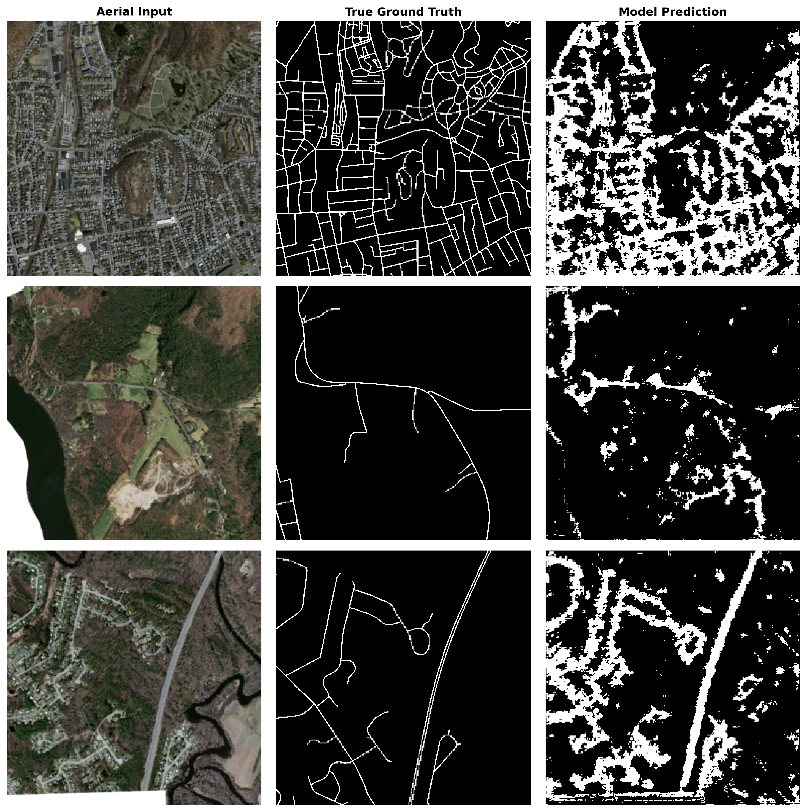
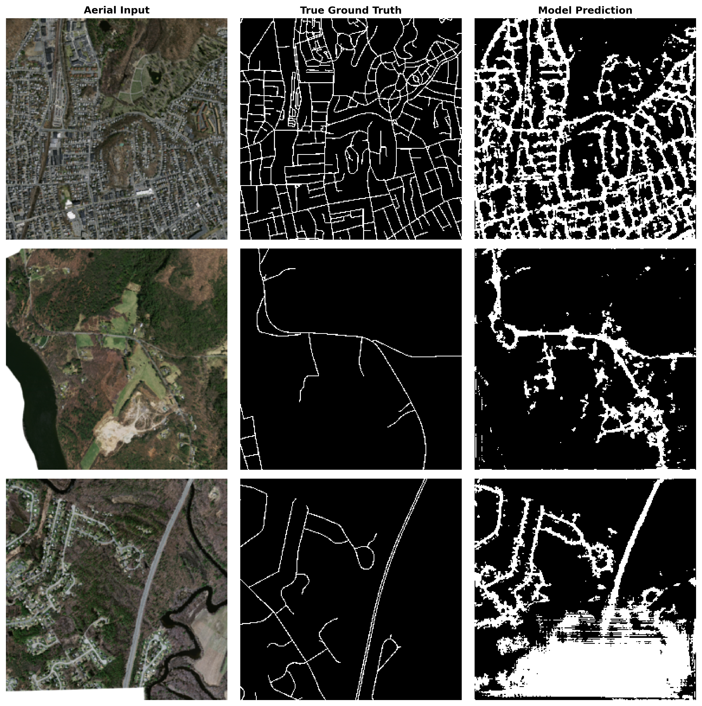
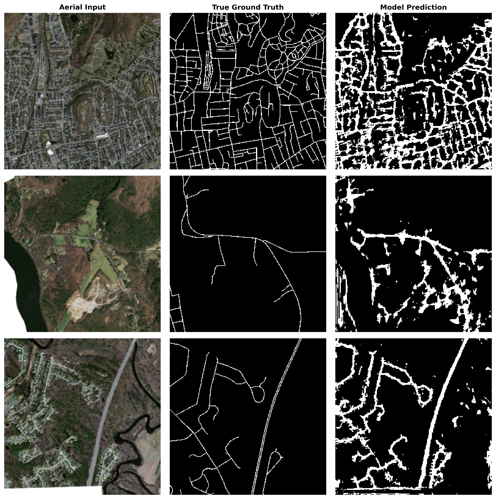
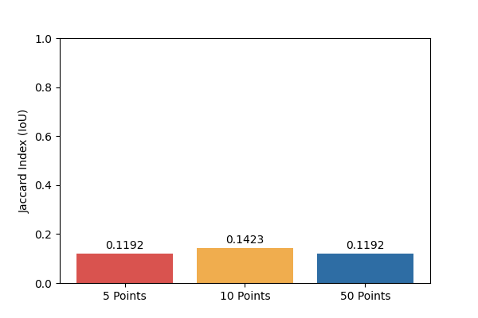

# strongly Supervised Road Segmentation with U-Net

A computer vision project exploring **weakly supervised semantic segmentation** for road scenes using a **U-Net architecture with a ResNet34 encoder**.

The project investigates how effectively a segmentation model can learn road-region representations from limited/weak supervision and evaluates the resulting segmentation quality across different training checkpoints.

---

## Overview

The model takes an input road image and predicts a pixel-level segmentation mask identifying the target road region.

### Key Components

* **Architecture:** U-Net
* **Encoder:** ResNet34
* **Framework:** PyTorch
* **Task:** Semantic image segmentation
* **Application:** Road scene segmentation
* **Training:** Weakly supervised segmentation
* **Model checkpoints:** 5-point, 10-point and 50-point variants

---

## Results

### Road Segmentation — 5 Point Checkpoint



### Road Segmentation — 10 Point Checkpoint



### Road Segmentation — 50 Point Checkpoint



### Checkpoint IoU Comparison



The visual comparisons show the predicted segmentation masks produced by the different checkpoints, while the IoU plot provides a quantitative comparison of segmentation performance.

---

## Model Architecture

The project uses a **U-Net encoder-decoder architecture** with a **ResNet34 backbone**.

The encoder extracts hierarchical visual features from the input image, while the decoder progressively reconstructs a pixel-level segmentation map.

```text
Input Image
     │
     ▼
ResNet34 Encoder
     │
     ├── Feature Extraction
     │
     ▼
U-Net Decoder
     │
     ├── Upsampling
     ├── Skip Connections
     │
     ▼
Segmentation Mask
```

---

## Model Checkpoints

The trained checkpoints are stored in the `checkpoints/` directory:

```text
checkpoints/
├── unet_resnet34_pts5.pth
├── unet_resnet34_pts10.pth
└── unet_resnet34_pts50.pth
```

Each checkpoint corresponds to a different training configuration used during the assessment.

---

## Project Structure

```text
.
├── README.md
├── project.yml
├── TahaZeeshan_TechnicalAssesment.pdf
│
├── assests/
│   ├── checkpoint_ious.png
│   ├── road_segmentation_comparison10pts.png
│   ├── road_segmentation_comparison50pts.png
│   └── road_segmentation_comparison5pts.png
│
├── checkpoints/
│   ├── unet_resnet34_pts10.pth
│   ├── unet_resnet34_pts5.pth
│   └── unet_resnet34_pts50.pth
│
└── code/
    ├── TECHNICAL_ASSESMENT_GOOGLE_COLLAB.ipynb
    └── technical_assesment_weakly_segmentation.py
```

---

## Code

The implementation is available in:

* `code/technical_assesment_weakly_segmentation.py` — main Python implementation
* `code/TECHNICAL_ASSESMENT_GOOGLE_COLLAB.ipynb` — experimental / assessment notebook

---

## Technical Assessment

The original technical assessment document is included in:

`TahaZeeshan_TechnicalAssesment.pdf`

---

## Reproducibility

The repository contains the source implementation, notebook, trained model checkpoints and visual evaluation results required to inspect the experimental workflow.

---

## Limitations

The results depend on the available supervision, training configuration and evaluation setup. Performance should therefore be interpreted within the context of the experimental assessment rather than as a general benchmark for road segmentation.

---

## Future Work

Potential extensions include:

* Training with larger and more diverse road datasets
* Stronger supervision and additional segmentation labels
* Experimenting with alternative encoder architectures
* Improving boundary and small-region segmentation
* More extensive quantitative evaluation
* Testing generalization across different road environments

---

## License

See the repository for licensing information.
