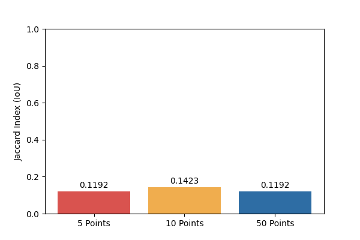
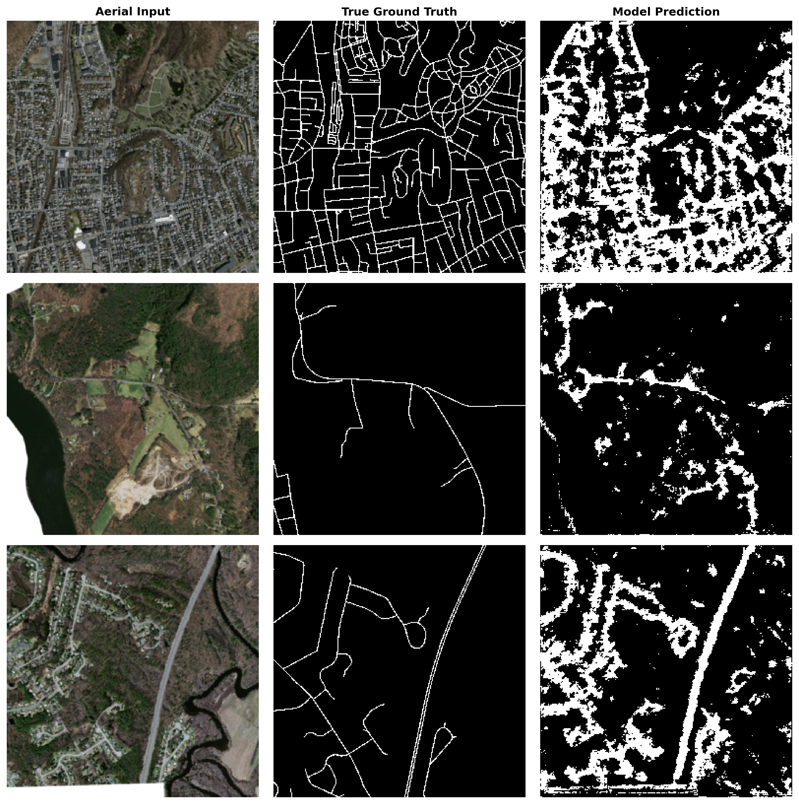
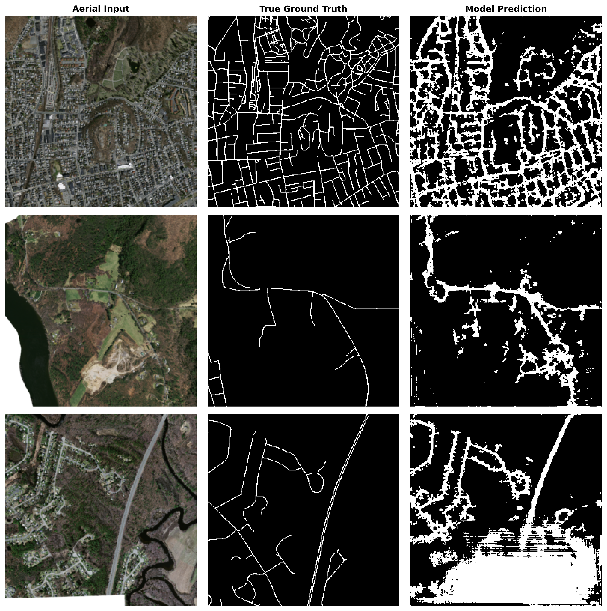
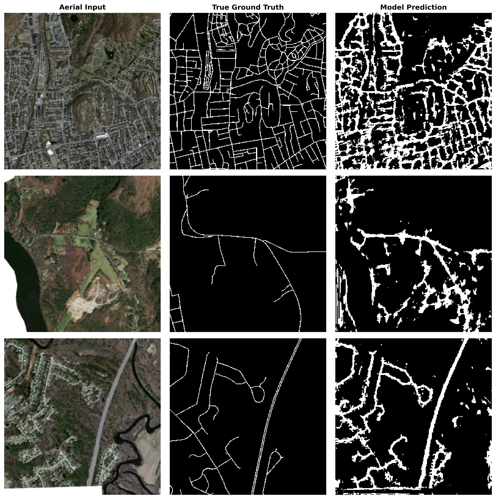

# Weakly Supervised Road Segmentation with U-Net

A computer vision project exploring **weakly supervised semantic segmentation** for road scenes using a **U-Net architecture with a ResNet34 encoder** in PyTorch.

The project investigates how effectively a segmentation model can learn pixel-level road representations from sparse point-level annotations (e.g. 5, 10, or 50 labeled points per class) and evaluates segmentation quality across different supervision levels.

---

## Directory Structure

The repository is organized into modular directories for clean separation of code, model weights, visual assets, and documentation:

```text
WEAKLY SEGMENTATION/
├── assets/                                    # Generated result figures & comparison plots
│   ├── checkpoint_ious.png
│   ├── road_segmentation_comparison5pts.png
│   ├── road_segmentation_comparison10pts.png
│   └── road_segmentation_comparison50pts.png
│
├── weights/                                   # Model checkpoints / trained weights (.pth)
│   ├── unet_resnet34_pts5.pth                 # 5-point supervision model
│   ├── unet_resnet34_pts10.pth                # 10-point supervision model
│   └── unet_resnet34_pts50.pth                # 50-point supervision model
│
├── code/                                      # Modular Python code & Jupyter Notebooks
│   ├── __init__.py                            # Package initialization
│   ├── dataset.py                             # AerialDataset & sparse point mask generator
│   ├── model.py                               # U-Net ResNet34 model builder
│   ├── metrics.py                             # IoU metric calculation & plotting utilities
│   ├── train.py                               # CLI script for model training
│   ├── evaluate.py                            # CLI script to evaluate checkpoints & plot metrics
│   ├── infer.py                               # CLI script for single-image inference
│   ├── technical_assesment_weakly_segmentation.py  # Standalone full pipeline runner
│   └── TECHNICAL_ASSESMENT_GOOGLE_COLLAB.ipynb     # Interactive Google Colab notebook
│
├── requirements.txt                           # Project Python dependencies
├── README.md                                  # Project documentation
├── project.yml                                # Project metadata configuration
└── TahaZeeshan_TechnicalAssesment.pdf        # Original technical assessment document
```

---

## Installation & Setup

1. **Clone the repository:**
   ```bash
   git clone <repository_url>
   cd "WEAKLY SEGMENTATION"
   ```

2. **Install required dependencies:**
   ```bash
   pip install -r requirements.txt
   ```

---

## Usage Guide

### 1. Interactive Colab / Jupyter Notebook
Run the notebook located in `code/TECHNICAL_ASSESMENT_GOOGLE_COLLAB.ipynb` in Google Colab or locally via Jupyter:
```bash
jupyter notebook code/TECHNICAL_ASSESMENT_GOOGLE_COLLAB.ipynb
```

### 2. Training a Model
Train the U-Net model with weak supervision using `code/train.py`:
```bash
python code/train.py --num-points 10 --epochs 10 --batch-size 8 --lr 0.0001
```

* `--num-points`: Number of sparse point labels per class (e.g. 5, 10, 50).
* `--epochs`: Number of training epochs.
* `--save-path`: Destination path to save trained weights.

### 3. Evaluating Model Checkpoints
Evaluate and compare saved weights in `weights/` using `code/evaluate.py`:
```bash
python code/evaluate.py
```
This script evaluates validation IoU across all checkpoints and generates comparison plots in `assets/`.

### 4. Single Image Inference
Run segmentation inference on an aerial input image using `code/infer.py`:
```bash
python code/infer.py --image-path /path/to/aerial_image.png --weights-path weights/unet_resnet34_pts10.pth
```

---

## Results & Visualizations

### Checkpoint IoU Metric Comparison


### Road Segmentation — 5 Point Supervision Checkpoint


### Road Segmentation — 10 Point Supervision Checkpoint


### Road Segmentation — 50 Point Supervision Checkpoint


---

## Model Architecture

The segmentation model utilizes a **U-Net encoder-decoder architecture** with a **ResNet34 backbone**:

```text
Input Image (256x256x3)
        │
        ▼
 ResNet34 Encoder ──(Skip Connections)──┐
        │                               │
        ▼                               ▼
  U-Net Decoder ◄───────────────────────┘
        │
        ▼
Segmentation Mask (256x256x2)
```

---

## License & Citation

Refer to `TahaZeeshan_TechnicalAssesment.pdf` for assessment details and dataset references.
